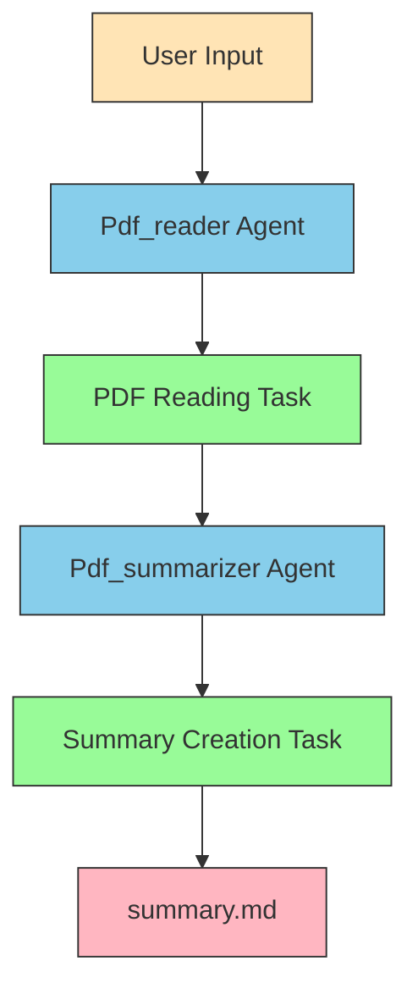

# RagCrew: PDF Summarization Crew

Welcome to RagCrew, a multi-agent AI system powered by [crewAI](https://crewai.com) that automates the process of reading and summarizing PDF documents. This project leverages the power of AI agents to extract key insights from PDF files and generate comprehensive summaries.

## Overview

RagCrew is designed to streamline the process of information extraction from PDF documents. It uses a crew of two AI agents:

- **Pdf_reader**: This agent is responsible for reading the content of a PDF file and extracting the most critical information, including key insights, emerging trends, and future outlooks.
- **Pdf_summarizer**: This agent takes the extracted information from the `Pdf_reader` and creates a detailed and polished final report in markdown format.

## Workflow

The workflow of the RagCrew is visualized in the diagram below:



1.  The process starts with user input specifying the topic to research.
2.  The `Pdf_reader` agent executes the PDF reading task to analyze the PDF and extract key information.
3.  The extracted information is then passed to the `Pdf_summarizer` agent.
4.  The `Pdf_summarizer` agent executes the summary creation task to create a comprehensive summary.
5.  The final summary is saved as a markdown file named `summary.md`.

## Getting Started

### Prerequisites

- Python >=3.10 <3.14
- [crewAI](https://docs.crewai.com) framework
- A Google API key (set in the `.env` file as `GOOGLE_API_KEY`)

### Installation

1.  **Clone the repository:**
    ```bash
    git clone <repository-url>
    cd rag_crew
    ```

2.  **Install dependencies using uv:**
    ```bash
    uv pip install -e .
    ```

3.  **Set up your environment:**
    -   Create a `.env` file in the root of the project.
    -   Ensure your `.env` file contains your Google API key:
        ```
        GOOGLE_API_KEY=your-google-api-key
        ```

### Running the Project

To run the RagCrew, execute the following command from the root directory:

```bash
run_crew
```

The application will prompt you to enter the topic you want to research from the PDF document.

**Important**: Before running, you need to add a PDF file named `sample.pdf` in the `src/rag_crew/` directory, or update the path in `src/rag_crew/crew.py` to point to your PDF file.

## Configuration

You can customize the agents and tasks by modifying the following files:

-   **`src/rag_crew/config/agents.yaml`**: Define the properties of your agents (e.g., role, goal, backstory).
-   **`src/rag_crew/config/tasks.yaml`**: Define the tasks for your agents (e.g., description, expected_output).
-   **`src/rag_crew/crew.py`**: Modify the crew's logic, tools, and arguments. This file contains the implementation of the agents and tasks, as well as the PDF tool configuration.
-   **`src/rag_crew/main.py`**: Change the input for your agents and tasks. This file handles user input and starts the crew.

**Important**: The application expects a PDF file at `src/rag_crew/sample.pdf`. You need to add your own PDF file at this location, or modify the path in `crew.py` to point to your desired PDF file.

## Future Work

-   [ ] Add support for more file types (e.g., DOCX, TXT).
-   [ ] Implement a web interface for uploading PDF files.
-   [ ] Add more agents to the crew for more complex tasks (e.g., a translator agent).
-   [ ] Improve error handling and user feedback.
-   [ ] Add support for processing multiple PDF files at once.
-   [ ] Implement caching mechanisms to avoid reprocessing the same PDF.
-   [ ] Add customization options for summary length and focus areas.
-   [ ] Integrate with cloud storage services for PDF retrieval.

## Support

For support, questions, or feedback regarding the RagCrew:
- Visit the [crewAI documentation](https://docs.crewai.com)
- Check the [crewAI GitHub repository](https://github.com/joaomdmoura/crewai)
- [Join the crewAI Discord community](https://discord.com/invite/X4JWnZnxPb)

Let's create wonders together with the power and simplicity of crewAI.